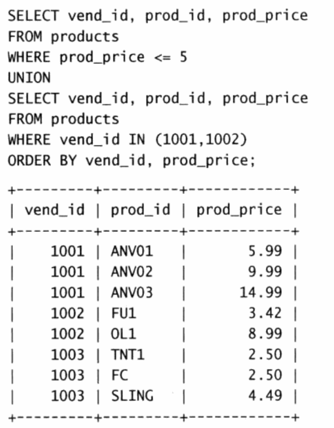

### mysql 必知必会

把书过了一遍。

前面的都是基础知识。

##### 函数

1. 使用 mysql 函数。比如查询年份，查指定天用date()，查某一月的数据用 year()=xxx and month() = xx
2. count 函数，count()不统计null， count(*) 表示null也统计,count(col) 特定列有值的计数。

## 笛卡尔积

当查询两个表确没写条件的时候就是笛卡尔积。

```mysql
select a.name,b.name from student a,student b;
```

结果有 N1*N2 条

## 什么时候用 UNION?

之前总觉得这个功能是个鸡肋，为什么会用到union? 同一种数据结构分成两个表？



书中是这样介绍的，疑惑：为什么不直接在where里写个  or  ？？？

