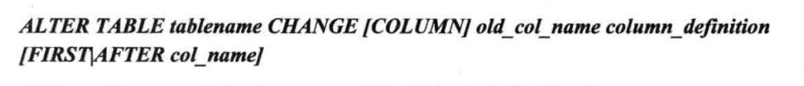

## DDL

数据库定义语句。对数据库，表的创建，删除

## 数据库操作

```mysql
// 创建数据库
CREATE DATABASE test1

// 使用 test1 数据库
USE test1

// 删除数据库
DROP DATABASE test1
```

## 表操作

mysql  的表名会以目录的形式储存于磁盘上，命名遵循目录的命名规范

###  基本又常用的操作

```mysql
// 创建表
CREATE TABLE student(
id int(11) ,
name varchar(15),
school_number varchar(10)
)

// 查看表结构
DESC student

// 查看创建表的语句
SHOW CREATE TABLE student

// 删除表
DROP TABLE student
```

###  经常忘的操作

#### 1. 修改字段

**语法：**


将 student 表 name 字段的数据类型改为 varchar(20)

```mysql
ALTER TABLE student MODIFY name varchar(20)
```

#### 2. 增加字段

**语法:**


给 student 表增加 age

``` mysq
ALTER TABLE student ADD COLUMN age int(3)
```

#### 3. 删除字段

**语法：**


删除 student 表的 age 字段

```
ALTER TABLE student DROP COLUMN age
ALTER TABLE student DROP age // COLUMN 是可选，加上更容易理解
```

#### 4. 字段改名

**语法：**



将 student 表的 name 字段 修改为 st_name

```mysql
ALTER TABLE student CHANGE name st_name varchar(10)
```

*change 和 modify 都可以修改表的定义，但是 change 要写两次字段名，可以修改字段名，modify 不可修改字段名*

#### 5. 修改字段排列顺序

1. 可以在添加字段的时候加上顺序。

   给 student 表添加 age 字段到 name 的后边

   ```mysql
   ALTERT TABLE student ADD age int(3) AFTER name
   ```

2. 直接修改字段的顺序

   将 age 字段放到最前面

   ```mysql
   ALTERT TABLE student MODIFY age int(3) FIRST
   ```

#### 6. 修改表名

**语法：**


 将 student 表 改为 st

``` mysql
ALTERT TABLE student RENAME st
```

