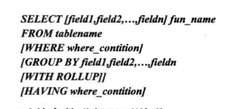
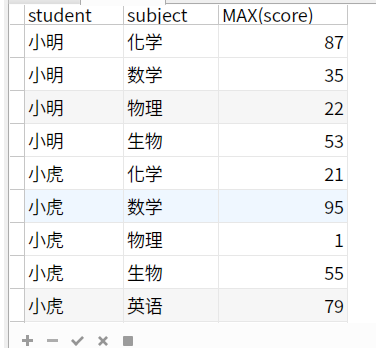
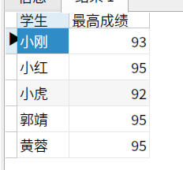
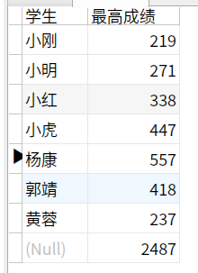
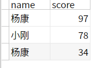
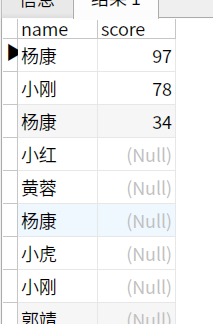

## DML

开发最常用的。插入，更新，删除，查询

## 常用的

由于是开发人员，这些语句经常用。就不详细记录了

```mysql
// 插入
INSERT INTO student (name,age) VALUES ('XIAOMING',18),('XIAOHONG',22)
// 更新
UPDATE student SET age=100 WHERE name='XIAOMING'

// 同时更新两张表
UPDATE student a,teacher b SET a.school_number=b.school_number,b.age=88 WHERE a.name = b.name 

// 删除记录
DELETE FROM student where id=1

// 一次删两个表的记录
DELETE a,b FROM student a,teacher b WHERE a.name=b.name and a.name = '小明'

// 查询
SELECT * FROM student where age = 8

// 查询（某一列）不重复的数据
SELECT DISTINCK name from student

// 排序   对于 age 相同的，再按 id 大小排序 
SELECT * FROM student ORDER BY age,id desc

// 取有限的数据 （从第10个开始，取10条）
SELECT * FROM student ORDER BY age LIMIT 10,10
```


## 有点意思

### 1. 聚合



像求最大值，平均值这类问题，就需要聚合来看。聚合谁呢？比如说求某个学生的平均成绩，那么就聚合这个学生。

student 表里存的数据是这样的

| 学生（student） | 科目(subject) | 成绩(score) |
| ---- | ---- | ---- |
| 小明 | 语文 |100|
| 小明 | 数学 |20|
| 小红 | 语文 |80|

```mysql
// 求每位同学的平均成绩
SELECT  student,avg(score) FROM student GROUP BY student
```

查询结果

| 学生（student） | avg(score) |
| --------------- | ---------- |
| 小明            | 60         |
| 小红 | 80   |

```mysql
// 求每科的平均成绩

SELECT subject,avg(score) FROM student GROUP BY subject
```


#### group by 后面跟两个字段是什么鬼？

先按第一个字段聚合，再按第二个字段聚合。比如，显示每个同学每科的最高成绩（可以理解为这个表包含多次考试成绩）

```mysql
SELECT
	student,
	`subject`,
	MAX( score ) 
FROM
	scores 
GROUP BY
	student,
	`subject`
```

结果如下



 ####  having 和 where 的区别

having 是过滤聚合函数处理后的结果，而where是过滤聚合函数处理后的结果

1. 求学生 所有单科大于10分的成绩之和，且只显示成绩之和小于100的。

   ```mysql
   SELECT
   	student 学生,
   	SUM( score ) 最高成绩 
   FROM
   	scores 
   WHERE
   	score > 10 
   GROUP BY
   	student 
   HAVING
   	最高成绩 < 100
   ```

   结果

   

#### WITH ROLLUP 用法

with roolup 会显示总的结果，比如求学生的所有成绩之和：

```mysql
SELECT
	student 学生,
	SUM( score ) 成绩之和 
FROM
	scores 
GROUP BY
	student WITH ROLLUP
```




null 对应的即为所有成绩之和

类似的，如果求最高成绩，那么null对应的就是表里最高的成绩

### 表连接

1. left join : 以左边表的数据为准，如果左边表有的数据，右边没有 ，那么就显示null，

```mysql
SELECT
	name,
	score 
FROM
	scores
	LEFT JOIN students ON students.id = scores.student
```

因为填充 score 的时候和 students id 关联了，所以不会出现和学生不匹配的成绩

 

如果right join 的话

```
SELECT
	name,
	score 
FROM
	scores
	RIGHT  JOIN students ON students.id = scores.student
```



#### 子查询

从一个查询结果中查询

查询关键字有： in , not in , = , != , exists, not exists

1. 统计每个同学的单科最高成绩

   你可能会想到这样写

   ```mysql
   SELECT id,student,subject,max(score) FROM scores GROUP BY student
   ```

   没错，我第一次就是这么写的。不过，通过查score表会发现，同一行的结果不统一。因为max(score)是计算出来的结果，mysql 才不会管这个值在表中有没有，是否要和id 对应起来。

   那么，用子查询吧

   >  思路：
   >
   > 在子查询里查询出每个学生的最高成绩 `SELECT MAX(score) FROM scores GROUP BY student`
   >
   > , 这个子查询的结果就是 ‘所有学生最高成绩的集合’
   >
   > 然后让查询的结果必须在 max_score 里面，这样就不会去关注不是‘学生最高成绩’的那部分。

   sql 如下

   ```mysql
   SELECT
   	* 
   FROM
   	scores 
   WHERE
   	score IN (
   	SELECT
   		MAX( score ) score 
   	FROM
   		scores 
   GROUP BY
   	student)
   ```

   这个问题在网上查到的答案是：

   ```mysql
   select b.* from (select name,max(score) score from course GROUP BY name) a left join course b on a.`name`=b.`name` and a.score=b.score;
   ```

   

   转化成我的表的字段

   ```
   SELECT
   	b.* 
   FROM
   	( SELECT student, max( score ) score FROM scores GROUP BY student ) a
   	LEFT JOIN scores b ON a.`student` = b.`student` 
   	AND a.score = b.score;
   ```

   解释一下：

   子查询的结果集是  学生+学生的最高成绩  ，结果集是 a

   然后这个 a 再 left join 一下 scores （给此时的 scores 命名 b ）

   最后限制条件是 b 的成绩和学生 对应子集 a 的。

   子查询的 student 和 原表的 student 实现了对应。确实比我写的严谨一点。假如子查询集中恰巧存在一个max score 对应一个学生较小的成绩。那么结果集中一个学生出现了两次，我写的sql结果就出错了。

### 记录联合

union 是 union all 后再distinct